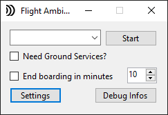
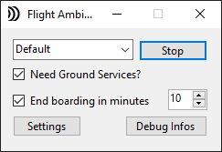
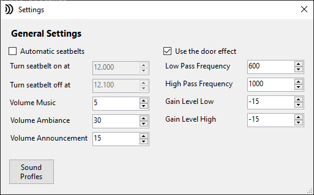

# Introduction 
This is a stand alone application for the Micrsoft Flight Simulator 2020. It based on my former App CrewSounds for FS9. Flight Ambiance tries to create a more realistic ambiance during the virtual flight. Depending on the current situation i.e. you can hear the passangers are entering the aircaft during the boarding process. When the flightdeck door is closed the announcments sounds a bit muffled.

# Requirements
* You need .NET 5 to run this app https://dotnet.microsoft.com/download/dotnet/5.0 or the SDK to build it.
* You need some dlls from un4seen https://www.un4seen.com/ for the sound output:
    * bass.dll as the main library
    * BASS FX
    * BASS.Net

# Installation
You can run the app from everywhere, it's not necessary to move it to the community folder.

# Running the app

The application comes with a simple sound profile for a jetliner. Start i.e. with an A320 at the gate at any airport and launch the profile. If desired, the application can call the jetways automatically, also when arriving at the destination. Set the timer in minutes to end the boarding automatically.

# Settings
## General settings

## Profile settings
